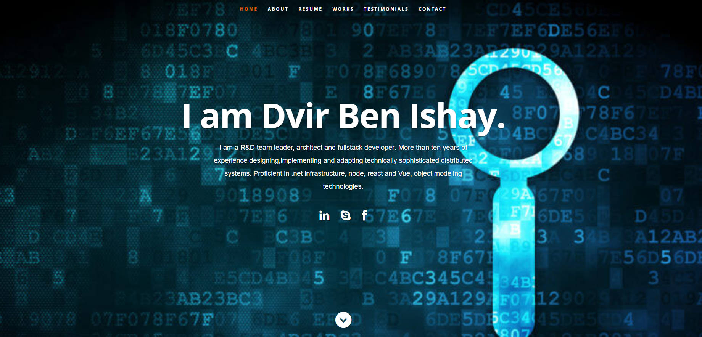

A simple SPA Portfolio template for developer/designers built with React. Use it to showcase your work, testimonials and other information to clients.

## Preview


## How to use
1. Clone/Download the repo.
2. Run  ``` npm install ```.
3. Change the values in ```src/resumeData.js``` to suit your use-case.
4. Run ```npm start``` to spin the up the local dev server port 3000.(http://localhost:3000).
5. Make required changes in ```src/resumeData.js``` to suit your needs.

<a href="https://app.daily.dev/dben"></a>
